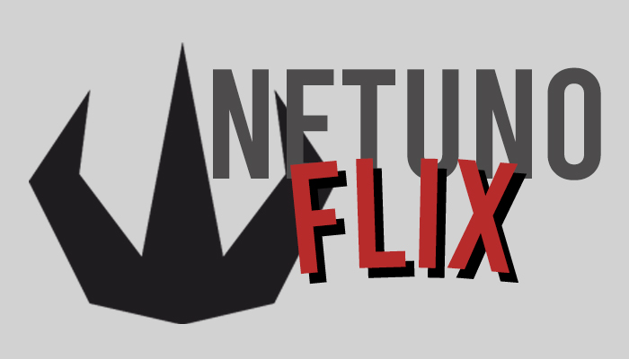

# NetunoFlix

> Um portfólio de filmes desenvolvido na linguagem C

## Sobre o projeto

A aplicação NetunoFlix foi desenvolvida pela **NETUNO** e visa disponibilizar um sistema que auxilie no cadastro e controle de filmes. A mesma foi construída para ser de simples utilização por parte do usuário, possiblitando a rápida e fácil criação de portfólios.

### Recursos

- [x] - Cadastro de filmes baseados em: Título, Gênero, Duração, Faixa Etária e Idioma
- [x] - Validação de dados para todas as entradas
- [x] - Lista dinâmica para visualização dos dados dos filmes
- [x] - Exclusão de filmes da lista
- [x] - Persistência de dados dos filmes

## 💻 Pré-requisitos

* `Windows 7 ou versão mais recente` 
* `GTK Runtime 3.0 for Windows`

## 🚀 Instalando o NetunoFlix

Para instalar a NetunoFlix, siga estas etapas:

> Realize o download da versão mais recente da NetunoFlix `v1.0.0`.

> Execute o `NetunoFlix_1_x_x_Installer.exe`.

__Caso não tenha o `GTK Runtime 3.0 for Windows` intalado em seu computador, a intalação será feita automaticamente.__

> Execute a aplicação ^^

## ☕ Usando o NetunoFlix

## 🤝 Reconhecimentos

* Prof. Leonardo Santana Almeida da Silva por conhecimentos em Bases de Programação
* Prof. Caio Eduardo Pinheiro Costa pelo apoio ao pojeto

## 🙋🏾‍♂️ Autores

* Camila Silva
* [Igor E. Oliveira](https://github.com/reedbluue)
* [Ingrid V. Rocha](https://github.com/pequenaa)
* [João P. Labussiere](https://github.com/Labussieree)
* Mateus Arruda
* Pedro M. Barreiro
  
## 📝 Licença

Esse projeto está sob licença. Veja o arquivo [LICENÇA](./LICENSE) para mais detalhes.
